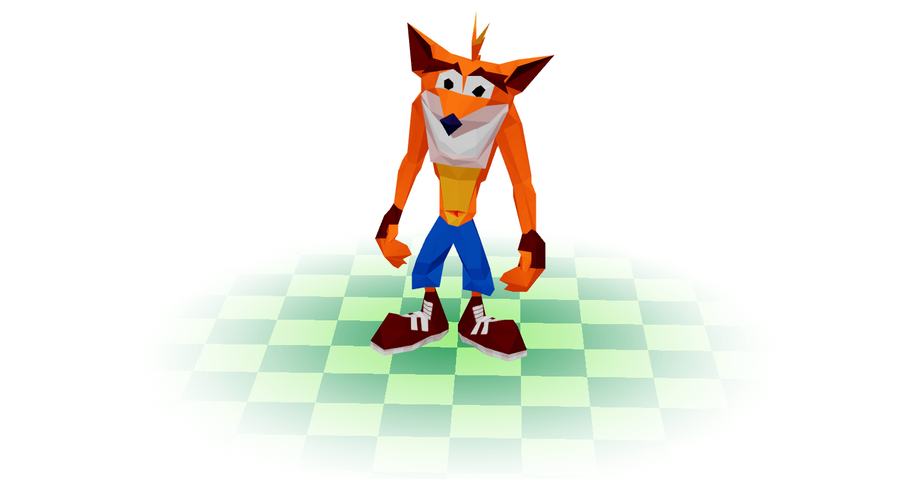

# PS1-inspired Jitter Shader demo

### This project demonstrates a custom Jitter Shader inspired by the visual style of PS1-era games. The shader replicates the nostalgic 'jitter' effect, adding a retro aesthetic to 3D models. Perfect for developers looking to add a retro feel to low poly projects.

## Demo

https://jitter-demo.otfnk.com

## Installation

- Install with `npm run install`
- Run the demo with `npm run dev`
- Build it with `npm run build`

## Credits

- Crash Bandicoot Low Poly model from [Sketchfab](https://sketchfab.com/3d-models/crash-bandicoot-1b03d855ede0483f8fa98ce0fdf7f62b) by [smitty462\_](https://sketchfab.com/smitty462_)

## License

[MIT](https://choosealicense.com/licenses/mit/)
